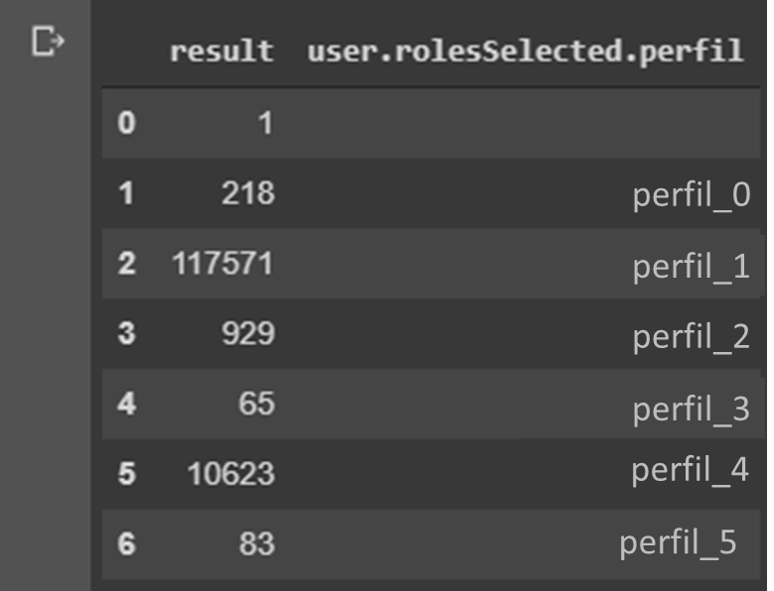

# Como conectar no KennIO utilizando Python
O objetivo aqui é mostrar como é possível consultar diretamente os dados do KeenIO e realizar manibulações básicas com o Pandas.
https://keen.io/ é a plataforma que fornece análises poderosas do produto rapidamente, com tempo mínimo de desenvolvimento.

# Acessando KeenIO com Python usando Jupyter
Autor: Marcos André Fabrício

E-mail: marcosandre.web@gmail.com
>A seguir, está um exemplo de conecção e impressão de resultado de uma "consulta criada" no KeenIO usando Python


```python
# Isntalar os pacotes necessários
pip install requests
pip install jsonlib
pip install pprint
```


```python
# importar pacotes
# request: para realizar requisições
# json: para trabalhar com o json resoltado da requisição
# pprint: para imprimir resultados de json de forma estruturada
import requests
import json
import pprint
```


```python
# se conectar no keenio em uma consulta já salva
response = requests.get("url da api da consulta no KeenIO")
```

200


```python
# printando status
print(response.status_code)
```

b'{"result": 10937}'


```python
# printar o conteúdo do request
pprint.pprint(response.content)
```


```python
# colocando o conteúdo do json do response dentro de uma variável para trabalhar
data = response.json()
```


```python
# printando o json
pprint.pprint(data)
```

{'result': 10937}

## Consultando um eventos isolados no KeenIO
Tipos de análises do KeenIO
1. sum
2. count
3. count_unique
84. minimum
5. maximum
6. average
7. select_unique
8. extraction
9. percentile
10. median
11. funnel

Primeiro é preciso instalar a biblioteca do keenIO, que permitirá se comunicar diretamente com a solução KeenIO.
Para isso, utilize o comando **pip** _(caso necessário, atualize este comendo)_


```python
# Isntalar os pacotes necessários
pip intall --upgrade keen
```


```python
# Importe os pacotes para trabalhar com data/time, keenIO e o cliente do keen
import keen
from keen.client import KeenClient
```


```python
# Indique qual o número do projeto e a chave para acessar a conta no KeenIO. 
# Essas informações são fornecidas na sua conta do KeenIO

KEEN_PROJECT_ID = "coloque o id do projeto do keenio"
KEEN_READ_KEY = "coloque a chave de leitura do keenio"
```


```python
# Usando o KeenClient para passar as informações de projeto e chave para dentro de uma variável "client"
client = KeenClient(
    project_id=KEEN_PROJECT_ID,
    read_key=KEEN_READ_KEY
)
```


```python
# Para este exemplo, estou verificando a quantidade de acessos na home de um site
# A variável "Timeframe" dentro da chamada, serve para passar a faixa de tempo que se deseja analisar.

acessos_home = client.count(
    "nome do Stream",
    timeframe={"start":"2019-08-28T00:00:00.000","end":"2019-08-29T00:00:00.000"}
)

pprint.pprint(acessos_home)
```

10989


```python
# Usando timeframe com tempo relativo sobre o hoje. Para isso, usa-se o "this_numero de dias_período"

acessos_home = client.count(
    "nome do Stream",
    timeframe={"this_14_days"}
)

pprint.pprint(acessos_home)
```

129484


```python
# Usando timeframe com tempo relativo sobre o hoje. Para isso, usa-se o "this_numero de dias_período"

acessos_home = client.count(
    "nome do Stream",
    timeframe={"this_14_days"}
)

pprint.pprint(acessos_home)
```

## Utilizando agrupamento e ordenação


```python
# Guardando o resultado do "count" do "Stream" dentro da variável acessos_home
# É possível usar as mesmas possibilidades do keenIO. Por exemplo: group_by
# "user.rolesSelected.perfil", onde "user" é parte do evento e "rolesSelected.perfil" é um valor de "user"

acessos_home = client.count(
    "nome do Stream",
    timeframe={"this_14_days"}, 
    group_by= {"user.rolesSelected.perfil"} 
)

pprint.pprint(acessos_home)
```

[{'result': 1, 'user.rolesSelected.perfil': ''},

 {'result': 218, 'user.rolesSelected.perfil': 'perfil_0'},
 
 {'result': 117571, 'user.rolesSelected.perfil': 'perfil_1'},
 
 {'result': 929, 'user.rolesSelected.perfil': 'perfil_2'},
 
 {'result': 65, 'user.rolesSelected.perfil': 'perfil_3'},
 
 {'result': 10623, 'user.rolesSelected.perfil': 'perfil_4'},
 
 {'result': 83, 'user.rolesSelected.perfil': perfil_5}]

Esse mesmo resultado foi obtido acessando uma consulta já pronta no keenIO. Mas a vantagem aqui, é que não foi precisa criar previamente essa consulta. Além disso, aqui, podede-se manipular livremente esses dados
___________
**acesses_home**, em um primeiro momento, pode parecer uma lista. Se executar o **type**, isso pode ser verificado:


```python
print (type(acessos_home))
```

<class 'list'>

Contudo, é uma lista composta de chave e valor. No caso a chave **result** e o **valor** de result, a chave **user.relesSelected.perfil** e a chave. Ou seja, NÃO é uma lista, mas sim um DICIONÁRIO DE DADOS.
___________
Para converter o dicionário de dados em tabela, vou usar o PANDAS.


```python
# 1º é preciso importar as bilibotecas
import numpy as np 
import pandas as pd 
```


```python
# Converter o dicionário de dados acesso_home em um DataFrame
df_Acessos_Home = pd.DataFrame.from_dict(acessos_home)
df_Acessos_Home
```




```python
# Criando os títulos da coluna em uma variável
titulo_coluna = ["Qtd_Acessos", "Perfil"]
```


```python
# Colocando os títulos da coluna no DataFrame Acessos_Home
df_Acessos_Home.columns = titulo_coluna
df_Acessos_Home
```
